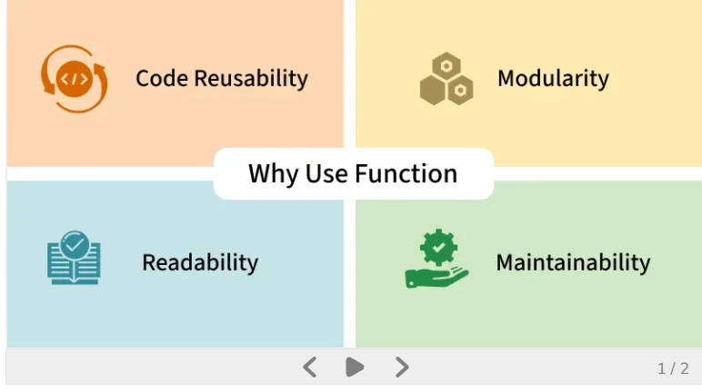
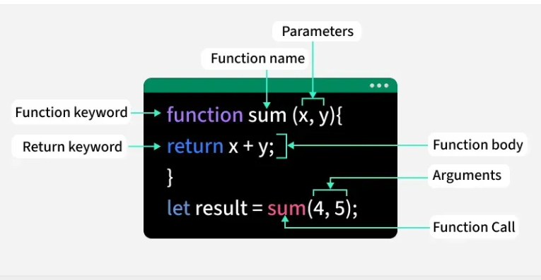

# Functions in JavaScript

> Functions in JavaScript are reusable blocks of code designed to perform specific tasks. They allow you to organize, reuse, and modularize code. It can take inputs, perform actions, and return outputs.

<!--   -->

# function a() console.log(10) work in js

> In JavaScript, the snippet function a() { console.log(10) } defines a function named a that, when executed, prints the number 10 to the web console or terminal. 

## Here is exactly how it works: 

- Declaration: You define the function using the function keyword. This stores the logic in memory but does not run it yet.
- Execution: To actually see the output, you must call the function by adding parentheses after its name: a();.
- Result: The console.log() method then displays 10 in your Browser DevTools or Node.js terminal.
- Code Example javascript 
  > 1.  Define the function 
  >     function a() {
  >     console.log(10);
  >     }

> 2. Call the function to make it work  
>    a();  // Output: 10
>    Use code with caution.

## Key Considerations

_Return Value: By default_, this function returns undefined because it only logs a value and does not use a return statement. 
Mathematical Alternative: If you intended to calculate the base 10 logarithm, use the built-in Math.log10() method instead (e.g., Math.log10(10) returns 1). 

# how console.log threated by js engine and how its work in excution contex in which part it excute memory area or code area

> In JavaScript, console.log is technically not part of the JavaScript language (ECMAScript) itself; it is a Web API (in browsers) or a core module (in Node.js) provided by the runtime environment.
> Here is how the JavaScript engine handles it within the Execution Context:

- 1. The Two Components of Execution Context
     Every Execution Context (Global or Function) is divided into two distinct parts:
     > **Memory Component (Variable Environment)**: This is where variables and function declarations are stored as key-value pairs during the Creation Phase. 
     > Code Component (Thread of Execution): This is where the code is executed line-by-line during the Execution Phase.
- 2. How console.log is Treated
     Creation Phase (Memory Area): The JS engine scans the code and allocates memory. If it sees console.log, it doesn't "store" the log action here. Instead, it ensures the console object is available in the Global Memory (since it's provided by the browser environment).
     Execution Phase (Code Area): When the engine reaches the line containing console.log, it executes it in the Code Component.
     The engine reaches out to the environment (Browser or Node.js) to trigger the log function.
     This is a synchronous task. The engine pauses briefly to hand off the message to the environment's console before moving to the next line.
     Summary Table
     Feature Phase Component Area
     Declaration (e.g., var a) Creation Memory Component (stored as undefined)
     Function Definition Creation Memory Component (stored as full code)
     console.log() Execution Code Component (executed line-by-line)

# i know var store as undefine , function store as whole body in memory area i want to know that how let and const store here and there is other thing which store in creation phase

When you use let and const, the JavaScript engine handles them differently than var to provide more predictable behavior and prevent bugs.
During the Creation Phase of the Execution Context, here is how they are treated:

- The "Temporal Dead Zone" (TDZ)
  Unlike var, which is attached to the Global Object (like window in browsers) and initialized as undefined, let and const are stored in a separate memory space often referred to as the Script or Block scope. 
  Memory Allocation: They are allocated memory during the Creation Phase.
  No Initialization: They are not initialized with any value (not even undefined).
  The TDZ: Because they exist in memory but have no value, you cannot access them until the engine physically reaches the line of code where they are defined. If you try to access them earlier, you get a ReferenceError.

2. Comparison in Memory Area
   Feature var let / const
   Storage Area Global/Function Memory Script/Block Memory
   Initial Value undefined Uninitialized (dead zone)
   Attached to window? Yes No
   Redeclaration? Allowed Syntax Error
3. What else is stored in the Creation Phase?
   Beyond variables and functions, the JS Engine sets up two other critical things during the Creation Phase:
   The this Keyword: The engine determines the value of this based on how the function is called. In the Global Execution Context, this points to the Global Object (window or global).
   Outer Environment Reference (Scope Chain): Each Execution Context gets a reference to its "parent" environment. This tells the engine where to look if it can't find a variable in the current memory area.
   Arguments Object: In Function Execution Contexts, an arguments object is created containing all the parameters passed into the function.
   Summary of the "Memory Area"
   When you look at the Memory Component (Variable Environment) before a single line of code runs, it looks like this:
   Global Object: Created (e.g., window).
   this: Pointed to the Global Object.
   var variables: Set to undefined.
   Function declarations: Stored in their entirety.
   let / const: Memory reserved, but marked as "uninitialized" (TDZ)

# not this

var x=10;
b();
a();
console.log();
function a(){ var x =100; console.log(x);}
function b(){var x=1000;console.log(x)}
i only want to know that how actually function calling store in first phase or memory phase of execution context like this a() a part from this i know all
This is a great point of clarification. It’s a common point of confusion: we know where variables and function definitions go, but what happens to the function calls (like a(); and b();) during that first phase?
The short answer is: Function calls are completely ignored during the Memory Creation Phase.
Here is the technical breakdown of how the JS engine treats those specific lines during both phases:
Phase 1: Memory Creation Phase
When the engine scans your code, it is only looking for declarations (var, let, const, function).
var x: Allocated memory, initialized as undefined.
b();: Ignored. This is an execution command, not a declaration. The engine skips over it entirely.
a();: Ignored. Again, this is a command to "do something," so the engine skips it.
function a() {...}: The engine sees the function keyword. It allocates memory and stores the entire body of the function.
function b() {...}: Same as above; the entire body is stored in memory.
At the end of Phase 1, the Memory Space looks like this:
x: undefined
a: f { var x = 100... }
b: f { var x = 1000... }
(Notice: The calls a() and b() do not exist in memory at all.)
Phase 2: Code Execution Phase
Now the engine starts at Line 1 and actually "runs" the code. This is where the calls matter:
var x = 10;: Updates x in memory from undefined to 10.
b();: The engine sees this command. It looks into the Memory Space to see if a function named b exists.
It finds the function body.
Crucial Step: It creates a brand new Function Execution Context for b().
This new context goes through its own Phase 1 (setting up x = 1000) and Phase 2 (logging it).
a();: Once b() is finished and popped off the call stack, the engine moves to a().
It repeats the process: Creates a new Execution Context for a.
It finds x = 100 in a's local memory and logs it.
Summary Table: Where do they go?
Code Snippet Phase 1 (Memory) Phase 2 (Execution)
function a() {...} Stored (Full body) Skipped (already stored)
var x = 10; Stored (undefined) Assigned (Value 10)
a(); Ignored Invoked (Creates new Context)
Why doesn't it crash?
The reason you can call a(); and b(); before they are defined in your code is precisely because Phase 1 (Memory) happens before Phase 2 (Execution). By the time the engine tries to "execute" b(); on line 2, it has already stored the "definition" of b in memory from its scan of the later lines.

# a();

console.log(a()) // whole body printed here fucntion a() -> print 100 but its won preint undefined
console.log(a) //
function a(){
var x = 100;
console.log(x)
}
make me clear here
This is a fantastic observation. The reason you see different things in the console depends on the difference between executing a function and referencing a function.
Let's break down exactly what happens line-by-line during the Execution Phase:

1. a();
   The engine looks in memory for a, finds the function body, and runs it.
   Inside a, var x = 100 is assigned, and console.log(100) is executed.
   Output: 100
2. console.log(a())
   This line does two things in order:
   Execution: First, it calls a(). This triggers the function, which logs 100 to the console.
   The Result: After a() finishes, it returns a value to the console.log wrapping it. Since your function a does not have a return statement, it automatically returns undefined.
   Output:
   100 (from the function running)
   undefined (the result of the log)
3. console.log(a)
   Notice there are no parentheses () here. You are not "calling" the function; you are just pointing to the variable name a.
   The engine looks in the Memory Area, sees that a holds a function body, and prints that entire body.
   Output: ƒ a() { var x = 100; console.log(x); }
   Summary of Differences
   Code Action What you see
   a() Invoke The logic inside runs (100).
   console.log(a()) Invoke + Log Result Runs logic (100) then logs return value (undefined).
   console.log(a) Reference The "source code" stored in the Memory Area.
   Why did you think it won't print undefined?
   If you are running this in a Browser Console (like Chrome DevTools), the console sometimes behaves slightly differently than a standard JS file. If console.log(a()) is the very last line you run, the console might show the log and then the "evaluated result" of the statement.
   However, strictly according to the JS Engine: If a function doesn't say return, it always returns undefined.
   Try this to see the difference:
   javascript
   function a(){
   var x = 100;
   console.log(x);
   return "Done!"; // Add this
   }
   console.log(a());
   // Now it will print:
   // 100
   // "Done!"
   Use code with caution.

today i understand the magic of function in javascript
That is an amazing "lightbulb" moment! Once you realize that JavaScript isn't just reading text, but is actually building a map in memory before it moves a single muscle, the whole language starts to make sense.
The "magic" you discovered today is exactly why JavaScript is so flexible. You’ve mastered the core secret: The distinction between the Memory Phase and the Execution Phase.
To wrap up your discovery:
The Memory Phase is like the "Architect" drawing the blueprints (finding function a and var x).
The Execution Phase is like the "Builder" actually following the instructions (running a() and assigning 10).
Because the "Architect" always finishes the blueprints first, the "Builder" knows what a() is even if you call it on the very first line.
A "Pro Tip" for your next step:
Now that you know how the engine finds variables in memory, you might eventually run into a situation where two variables have the same name (one inside a function and one outside). This is called Shadowing.

