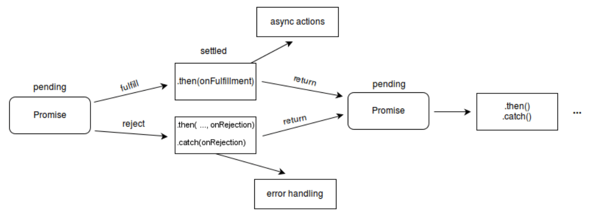

# 1. What is a Promise

A **Promise** is a JavaScript object that handles **asynchronous operations**.

It represents the **future result** of an operation.

A promise has two main things:

- **State**
- **Result (data)**

---



> A Promise always starts in the pending state.

- It can then move to only one of the two states:

- Fulfilled → operation successful

- Rejected → operation failed

> Important rule:
> \*Once a promise is fulfilled or rejected, its state cannot change again.

---

## 2. Default State of a Promise

When a promise is created, it looks like this internally:

```
Promise {
   state: "pending",
   result: undefined
}
```

### Promise States

1. **Pending** → Initial state (waiting for result)
2. **Fulfilled** → Operation successful
3. **Rejected** → Operation failed

---

## 3. Your Example (Corrected Explanation)

```js
const cart = ["shoes", "pants", "kurta"];
```

User wants to:

1. Create order
2. Then proceed to payment

---

## 4. Problem with Callback Approach

```js
createOrder(cart, function (orderId) {
  proceedToPayment(orderId);
});
```

### Why this is a problem

- `createOrder` takes time (API call)
- `proceedToPayment` also takes time
- If we keep nesting callbacks, code becomes messy

This leads to:

```
Callback Hell
Pyramid of Doom
```

Example:

```js
createOrder(cart, function (orderId) {
  proceedToPayment(orderId, function () {
    showSummary(function () {
      updateWallet();
    });
  });
});
```

Hard to read, debug, and maintain.

---

## 5. Promise-Based Approach (Your Main Idea)

```js
const promise = createOrder(cart);
```

### What happens internally

Immediately after this line:

```
promise = {
   state: "pending",
   result: undefined
}
```

After some time (API response comes):

```
promise = {
   state: "fulfilled",
   result: orderId
}
```

JavaScript automatically updates the promise.

---

## 6. Handling the Promise

```js
promise.then(function (orderId) {
  proceedToPayment(orderId);
});
```

### What `.then()` does

- It waits for the promise to be fulfilled.
- When result comes, it executes the function.

So:

1. Order created
2. Promise fulfilled
3. `.then()` runs
4. Payment starts

This ensures:

- Correct execution order
- No timing issues
- Cleaner code

---

## 7. Why Promises Are Better

Promises:

- Avoid callback hell
- Improve readability
- Handle errors better
- Provide chaining
- Work with async/await

---

## 8. Real Flow of Your Example

### Step-by-step execution

```js
const promise = createOrder(cart);
```

State:

```
pending
```

After API response:

```
fulfilled → orderId
```

Then:

```js
promise.then(function (orderId) {
  proceedToPayment(orderId);
});
```

Payment starts only after order creation.

---

## 9. Full Example (Correct Implementation)

### createOrder function

```js
function createOrder(cart) {
  return new Promise(function (resolve, reject) {
    if (!cart.length) {
      reject("Cart is empty");
    }

    setTimeout(() => {
      const orderId = "12345";
      resolve(orderId);
    }, 2000);
  });
}
```

### Using the promise

```js
createOrder(cart)
  .then(function (orderId) {
    return proceedToPayment(orderId);
  })
  .catch(function (err) {
    console.log(err);
  });
```

---

## 10. Most Important Concept (Interview Point)

A promise is:

> A container for a future value.

You don’t control when it finishes, but you control **what happens after it finishes**.

---

## 11. Your Concept — Corrected Summary

Your original idea, but corrected:

> A promise handles asynchronous execution in JavaScript.
> It is an object that represents the future result of an operation.
> Initially, it is in the **pending state** with an **undefined result**.
> After the asynchronous operation completes, the promise becomes either:
>
> - **fulfilled** with a value, or
> - **rejected** with an error.
>
> Using `.then()`, we can handle the result once the promise is fulfilled.
> This avoids callback hell and makes the code cleaner and more reliable.

---

# What you should practice.

### 1. Write your own Promise functions

Example tasks:

- Fake API for login
- Fake payment system
- Fake data fetch

```js
function loginUser(username) {
  return new Promise((resolve, reject) => {
    setTimeout(() => {
      if (username === "Rahul") {
        resolve("Login successful");
      } else {
        reject("User not found");
      }
    }, 2000);
  });
}

loginUser("Rahul")
  .then((res) => console.log(res))
  .catch((err) => console.log(err));
```

---

### 2. Promise Chaining (very important)

Practice this flow:

```
createOrder → payment → summary → updateWallet
```

---

### 3. Learn these 4 Promise methods

You must know these for interviews:

| Method               | Use                                      |
| -------------------- | ---------------------------------------- |
| Promise.all()        | Run tasks in parallel, fail if one fails |
| Promise.allSettled() | Wait for all, even if some fail          |
| Promise.race()       | First finished promise wins              |
| Promise.any()        | First successful promise wins            |

---

### 4. Convert Promise code to async/await

Example:

```js
async function process() {
  try {
    const orderId = await createOrder(cart);
    const payment = await proceedToPayment(orderId);
    console.log(payment);
  } catch (err) {
    console.log(err);
  }
}
```

---

## Interview-level learning path for you

Since you are preparing for tech roles:

1. Callbacks
2. Promises
3. Promise chaining
4. Promise methods (all, race, etc.)
5. async/await
6. Event loop deep dive

---

Here are **JavaScript Promise interview questions** arranged from **basic to advanced**.
These are the types of questions commonly asked in **frontend and full-stack interviews**.

---

# JavaScript Promise Interview Questions

## Basic Level (Very common in interviews)

### 1. What is a Promise in JavaScript?

**Expected answer:**
A Promise is an object that represents the eventual completion or failure of an asynchronous operation and its resulting value.

---

### 2. What are the three states of a Promise?

**Answer:**

1. Pending
2. Fulfilled
3. Rejected

---

### 3. What is the difference between synchronous and asynchronous code?

**Expected idea:**

- Synchronous: runs line by line.
- Asynchronous: runs in the background and completes later.

---

### 4. How do you create a Promise?

```js
const promise = new Promise((resolve, reject) => {
  resolve("Success");
});
```

---

### 5. What are `.then()` and `.catch()` used for?

**Answer:**

- `.then()` handles success.
- `.catch()` handles errors.

---

### 6. What is promise chaining?

```js
createOrder(cart)
  .then((orderId) => proceedToPayment(orderId))
  .then((payment) => showSummary(payment))
  .catch((err) => console.log(err));
```

---

## Intermediate Level (Very important)

### 7. What is the difference between callback and Promise?

| Callback              | Promise                    |
| --------------------- | -------------------------- |
| Nested functions      | Chained functions          |
| Callback hell         | Cleaner code               |
| Hard to manage errors | Centralized error handling |

---

### 8. What does `fetch()` return?

**Answer:**
A Promise that resolves to a **Response object**.

---

### 9. What is the difference between `.then(console.log)` and `.then(() => console.log())`?

**Answer:**

- `.then(console.log)` → logs the resolved value.
- `.then(() => console.log())` → logs nothing because no value is passed.

---

### 10. What happens if a promise is rejected and there is no `.catch()`?

**Answer:**
It causes an **unhandled promise rejection error**.

---

### 11. What is the difference between `resolve()` and `reject()`?

| resolve()                  | reject()                  |
| -------------------------- | ------------------------- |
| Marks promise as fulfilled | Marks promise as rejected |
| Sends success value        | Sends error               |

---

## Promise Methods (Very common in interviews)

### 12. What is `Promise.all()`?

Runs multiple promises in parallel and:

- Resolves when all succeed
- Rejects if any one fails

Example:

```js
Promise.all([p1, p2, p3]).then((results) => console.log(results));
```

---

### 13. What is `Promise.race()`?

Returns the result of the **first promise that settles** (success or failure).

---

### 14. What is `Promise.allSettled()`?

Waits for all promises to finish, regardless of success or failure.

---

### 15. What is `Promise.any()`?

Returns the **first fulfilled promise**.
Ignores rejected ones unless all fail.

---

## Coding Questions (Very likely)

### 16. Convert callback to promise

Callback:

```js
getData(function (data) {
  console.log(data);
});
```

Convert to promise-based version.

---

### 17. Write a function that returns a promise

That resolves after 2 seconds.

Expected:

```js
function delay() {
  return new Promise((resolve) => {
    setTimeout(() => resolve("Done"), 2000);
  });
}
```

---

### 18. What is the output of this code?

```js
console.log("Start");

setTimeout(() => console.log("Timeout"), 0);

Promise.resolve().then(() => console.log("Promise"));

console.log("End");
```

**Correct output:**

```
Start
End
Promise
Timeout
```

---

## Advanced Level (Top interviews)

### 19. What is the difference between async/await and promises?

- async/await is syntactic sugar over promises.
- Makes asynchronous code look synchronous.

---

### 20. What is the microtask queue?

- Promises go into the **microtask queue**.
- It has higher priority than the callback queue.

---

### 21. Can a promise change state after being fulfilled?

**Answer:**
No. A promise is **immutable after settlement**.

---

### 22. What happens if you return a promise inside `.then()`?

It creates a **promise chain** and waits for it.

---

## Real Interview Coding Question

Write a function that:

1. Creates an order
2. Proceeds to payment
3. Shows summary

Using promises.

---
